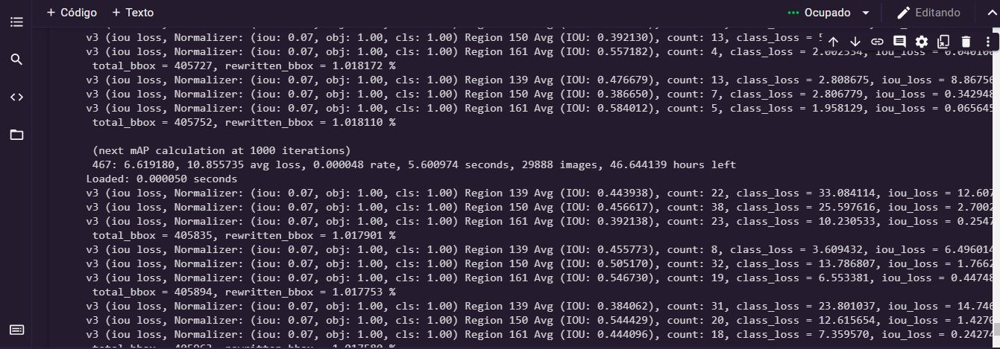

# Una Lectura del Paro Nacional
Repositorio asignatura Introducción al análisis de Datos Universidad Nacional de Colombia.

El Estado Colombiano está enfrentando en estos momentos la mayor crisis económica y política de las últimas décadas desde hace más de un mes. La emergencia sanitaria provocada por la pandemia del COVID 19 agudizó las ya precarias condiciones de vida de los ciudadanos del común llegando a extremos tan alarmantes tales como, según cifras del [Dane](https://www.portafolio.co/economia/dane-2-4-millones-de-hogares-ya-no-comen-tres-veces-al-dia-en-colombia-550416
) en su encuesta Pulso Social, a fecha del 25 de marzo:
>*(...)son más  2,4 millones los hogares que ingieren menos de tres porciones diarias de alimento, 2,2 millones de familias en el país comen dos veces al día, 179.174 hogares se alimentan solo una vez y 23.701 hogares a veces no tienen un plato diario(..)*

Estas emergencias conllevaron a que el gobierno nacional se planteará una reforma tributaria que aliviará el déficit presupuestal  necesario para combatir los embates de la pandemia y sus efectos en la pobreza ciudadana, la seguridad alimentaria, el desarrollo económico y empresarial del país, que según [cifras](https://id.presidencia.gov.co/Paginas/prensa/2020/Colombia-invierte-cerca-de-117-billones-de-pesos-para-atender-la-Emergencia-Economica-por-la-pandemia-del-covid-19-200527.aspx) del gobierno  es por lo menos el 11,8%  del PIB  equivalente a unos 117 billones de pesos. Pero, como muestra la [investigación](https://razonpublica.com/gasto-del-gobierno-la-pandemia-aun-no-sabemos-se-invierte-peso-peso/)  realizada por el portal Razón Pública no hay transparencia efectiva de  tener trazabilidad sobre los objetivos de  tal inversión y los montos reales ejecutados hasta la fecha de esta cifras.

Tal reforma ocasionó en Colombia  terminó de encender el denominado *“estallido social”*  que hasta la fecha se  ha mantenido encendido-quizá no con la misma intensidad-ni con el mismo objetivo principal vislumbrado inicialmente-derivando en un fenómeno  familiar para los colombianos pero  extremadamente brutal para la  comunidad internacional, esto es,  la desmedida brutalidad policial y represiva del Estado.
Según [cifras](http://www.indepaz.org.co/victimas-de-violencia-homicida-en-el-marco-del-paro-nacional/) del Observatorio de DDHH, Conflictividades y Paz de Indepaz, hasta la fecha se han presentado 72 víctimas de violencia homicida  en el marco de las protestas, cifra que contrasta enormemente con las [presentadas](https://www.fiscalia.gov.co/colombia/hechos-concretos/paro-nacional-fiscalia-investiga-14-muertes-presuntamente-registradas-durante-las-manifestaciones/) por la Fiscalía General de la Nación los cuales aseveran que son 14 las presuntas muertes relacionadas de manera directa con el paro nacional y  de las cuales sólo se reconocen [oficialmente](https://www.bluradio.com/nacion/gobierno-confirma-25-muertos-en-protestas-y-reconoce-que-3-fueron-por-exceso-de-la-fuerza-publica) 3 de ellas.
Debido a esto y a las inconsistencias entre las cifras [presentadas](https://www.oas.org/es/cidh/informes/pdfs/ObservacionesVisita_CIDH_Colombia_SPA.pdf) por las diferentes entidades gubernamentales. La ciudadanía manifestante,  organizaciones de Derechos Humanos, colectivos de periodistas independientes, transeúntes que  no están involucrados directamente en las actividades de paro, congresistas, entre  otros, han  decidido usar como medio de divulgación masiva de información las redes sociales en especial la red social Twitter, Instagram, Facebook y la reciente Tiktok. El denominado [*bombardeo de información*](https://reutersinstitute.politics.ox.ac.uk/sites/default/files/2021-06/Digital_News_Report_2021_FINAL.pdf) ha ocasionado una sobresaturación en la ciudadanía que a diario ve como cientos de videos circulan por sus redes y les es difícil determinar la veracidad de los contenidos que observan o tan siquiera determinar  una línea coherente de tiempo  que asimilar y/o  tomar posturas no sesgadas sobre los acontecimientos.

EL Archivo de datos Datos.xslm contiene las anotaciones de los eventos ocurridos en el marco del Paro Nacional durante los últimos 5 meses. Estos se dejarán de actualizar el dia 09 de septiembre de 2021.

## **Entregables:** 

Debido a la naturaleza del conjunto de datos solo será disponible por el momento para miembros de la comunidad académica de la Universidad Nacional de Colombia. Este documento puede encontrarse en este [enlace.](https://docs.google.com/document/d/1gXCuSWAIwyD7BDOZR9YlFsEYG7aAFjewVMyjsqSQNEk/edit?usp=sharing) 

## Notebook del proyecto disponible en Google Colab 

Debido a las neceidades tecnicas del proyecto se recomienda el uso de esta plataforma ya que es como mínimo  el uso necesario  de GPUs. Aunque como sugerencia es necesaria la versión Colab Pro debido a su extenso y continuo uso de estos elementos. 

### Ejemplo de video YOLOv4

  

¡Salud!
